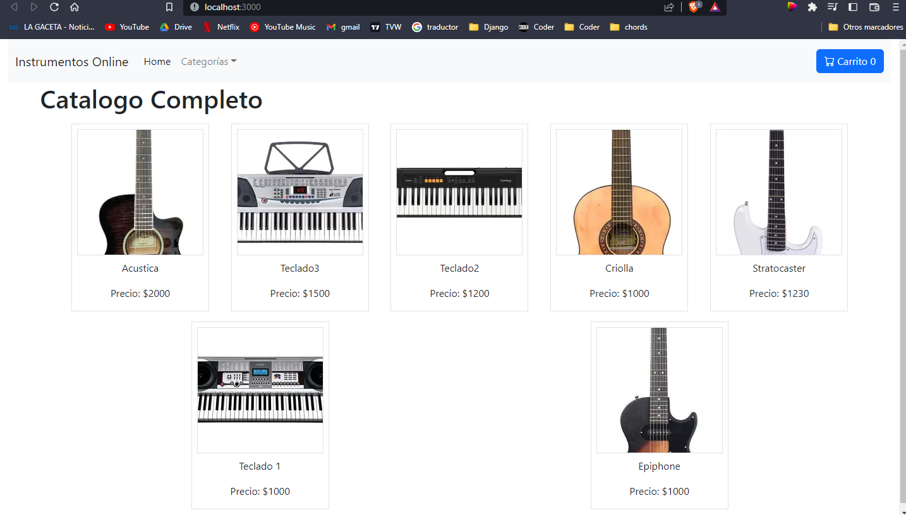
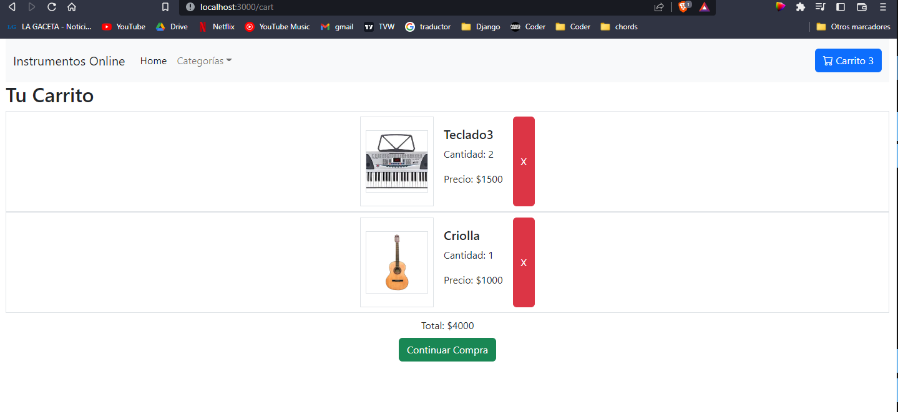

# coder-react
# Francisco Salvador Carreño Giscafré

Repositorio del curso de React de Coderhouse.

# Proyeto : Tienda de instrumentos musicales

Proyecto creado con react, se trata de una tienda que posee una página principal con los productos a la venta, un carrito y un formulario simple para realizar la compra.

### firebase

La base de datos del proyecto está alojada en Firestore de Firebase
La aautenticación de la base de datos se encuentra en variables de entorno para mayor seguridad
cuenta con los siguentes funcionalidades:
* Consultar el stock de los productos
* Al realizar la compra registra la merma correspondiente en el stock
* Registra los datos del formulario del usuario en el formulario de compra

# Prints de pantalla del proyecto

## página de inicio

## Añadir produnto en el ItemDetail.js

## Carrito

## Continuar compra mostrando el formulario para ingreso de datos del usuario

## Compra finalizada

## Base de datos en Firebase (muestra la compra realizada)
